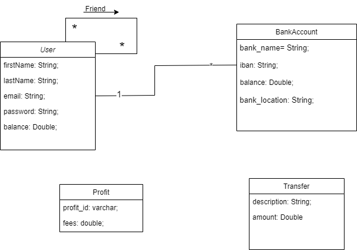

#Pay My Buddy

The Pay My Buddy app. Developing with spring boot. That allows transactions between users to users and users to bank.

Note : Configure before the data.json file path in the application.properties in order to start the application

##Prerequisites 

•Java 1.8

•Maven 3.6.2

•Spring-boot 2.6.13-SNAPSHOT

•Maven 3.6.2

•MySQL 8

##Installing

A step by step series of examples that tell you how to get a development env running:

1.Install Java:

https://docs.oracle.com/javase/8/docs/technotes/guides/install/install_overview.html

2.Install Maven:

https://maven.apache.org/install.html

3.Install MySQL Workbench 8:

https://www.mysql.com/fr/products/workbench/

##Running App

To run the app you go to the folder PayMyBuddy

To set up the tables and data in the database. Please run the sql commands present in the 
PayMyBuddyDataBase.sql file.

###Steps for Windows 10 

Click on the Start Menu and search for “environment variables.”
Click on the environment variable end you create new environment variable 
1: Now enter the Variable Name: spring.datasource.username and Value:username
and its Value and press the OK button.
2: Now enter the Variable Name: spring.datasource.password and Value:database password
and its Value and press the OK button.

###after

Compile and generate the final jar by running command line: mvn clean package

After for start application digit

Command line : mvn spring-boot:run

To access the application, open your favorite browser and go to address: http://localhost:8080

##Testing
To run the tests execute the command: mvn verify

To generate the project's reports site, please run : mvn site

###UML: Unified Modeling Language

###PDM: Physical Data Model

